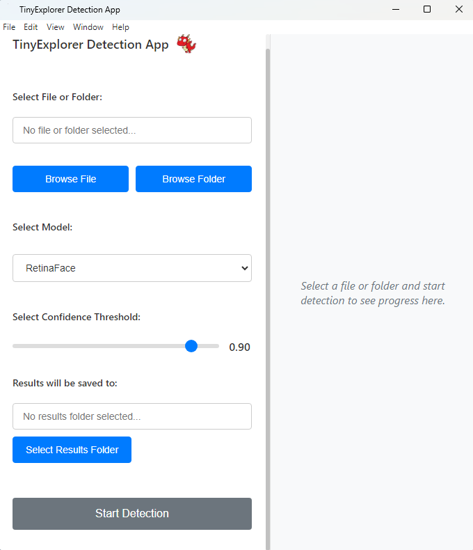

# TinyExplorer Detection App

  
   
  <em>Main application interface showing file selection, model options, and confidence threshold controls</em>

## Overview
The TinyExplorer Detection App is a user-friendly graphical interface designed specifically for developmental psychologists working with infants and young children. This toolbox integrates state-of-the-art open-source face recognition algorithms into an easy-to-use software package, streamlining the process of analyzing facial data in developmental research.

## Features
- Simple graphical user interface for easy operation
- Integration of cutting-edge face recognition models
- Batch processing capabilities for efficient analysis of large datasets
- Customizable confidence thresholds for detection accuracy

## Privacy & Data Security

**All processing is performed entirely on your local machine.** No images, videos, or detection results are ever uploaded to external servers. Your research data stays completely private and under your control.

- No cloud processing or data transmission
- No internet connection required after initial model download
- Models are downloaded once and stored locally
- Ideal for working with sensitive research data involving human subjects

## Installation

Head over to **[Getting Started](getting-started.md)** for full, OS-specific installation instructions.

!!! warning "macOS users"
    The app is not signed with an Apple Developer certificate, so macOS will block it from opening if you just drag it to Applications. The [Getting Started](getting-started.md) guide walks you through the one-time Terminal command needed to approve the app.

See also: [Supported File Formats](main-features.md#supported-file-formats).

## Documentation Sections

- [Getting Started](getting-started.md)
- [Main Features](main-features.md)
- [Understanding Results](understanding-results.md)
- [Advanced Options](advanced-options.md)
- [Troubleshooting](troubleshooting.md)
- [Support and Updates](support.md)
- [About](about.md)

---

## Copyright & Attribution

**© Cardiff Babylab**

### Project Team

- **Concept and Project Management:** Teodor Nikolov & Hana D'Souza
- **Lead Development and Implementation:** Tamas Foldes
- **Code Contributions:** Craig Thompson, Cátia M. Oliveira, Ziye Zhang & Teodor Nikolov

## Funding

This work was supported by a [James S. McDonnell Foundation (JSMF) Opportunity Award](https://doi.org/10.37717/2022-3711) and a UKRI Future Leaders Fellowship (MR/X032922/1) awarded to HD.
